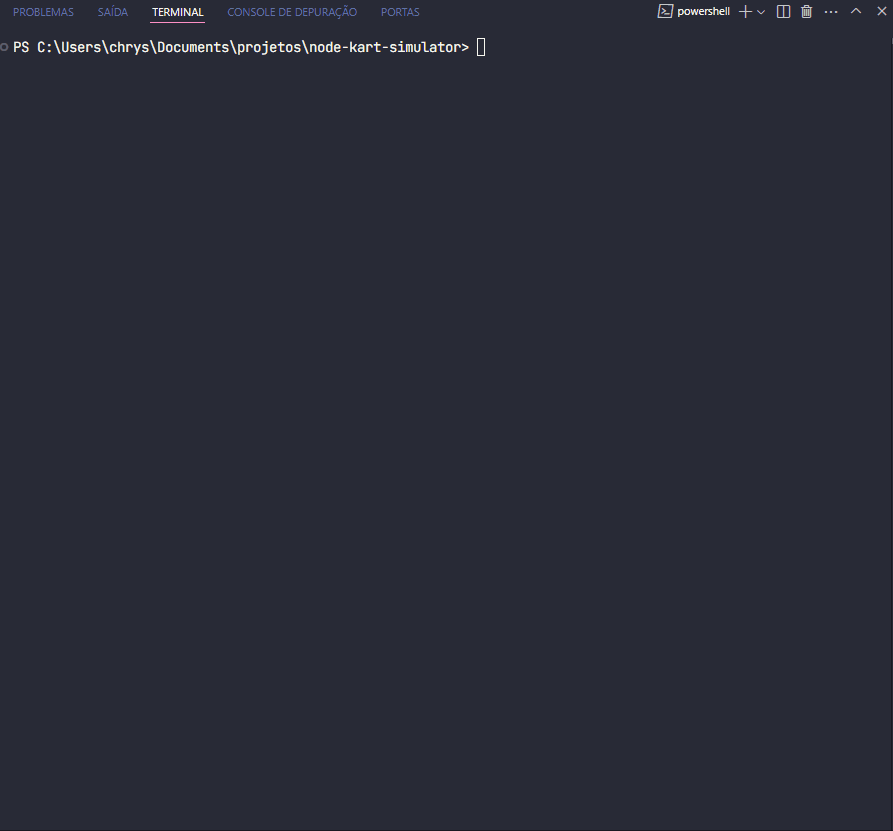

<h1 align="center">Node Mario Kart Simulator 🏁</h1>

 A fun and dynamic racing logic simulator inspired by the classic Mario Kart series.

<a href="#-screenshots">Screenshots</a>&nbsp;&nbsp;&nbsp;|&nbsp;&nbsp;&nbsp;
<a href="#-objective">Objective</a>&nbsp;&nbsp;&nbsp;|&nbsp;&nbsp;&nbsp;
<a href="#-rules">Rules</a>&nbsp;&nbsp;&nbsp;|&nbsp;&nbsp;&nbsp;
<a href="#-players">Players</a>&nbsp;&nbsp;&nbsp;|&nbsp;&nbsp;&nbsp;
<a href="#-technologies">Technologies</a>&nbsp;&nbsp;&nbsp;|&nbsp;&nbsp;&nbsp;
<a href="#-features">Features</a>&nbsp;&nbsp;&nbsp;|&nbsp;&nbsp;&nbsp;
<a href="#-how-to-run">How to Run</a>&nbsp;&nbsp;&nbsp;|&nbsp;&nbsp;&nbsp;
<a href="#-contributing">Contributing</a>&nbsp;&nbsp;&nbsp;|&nbsp;&nbsp;&nbsp;
<a href="#support">Support</a>

  

 

## 📸 Screenshots

 

## 🧭 Objective

  <table>
        <tr>
            <td>
                
            </td>
            <td>
                <b>Objetivo:</b>
                
Mario Kart is a series of racing games developed and published by Nintendo. Our challenge is to create the game logic to simulate Mario Kart-style races, with rules and mechanics listed below.

            </td>
        </tr>
    </table>

 

## 🎮 Rules

### **🧍‍♂️ Players**

- [x] The computer must receive two characters to race, each represented by an object.

 

### **🛣️ Tracks**

- [x] The characters will race on a random track with 5 rounds.
- [x] In each round, a section of the track will be randomly selected: **straight**, **curve**, or **duel**.
  - [x] If the section is a **STRAIGHT**, each player rolls a 6-sided die and adds their **SPEED** attribute. The highest total earns 1 point.
  - [x] If the section is a **CURVE**, each player rolls a 6-sided die and adds their **HANDLING** attribute. The highest total earns 1 point.
  - [x] If the section is a **DUEL**, each player rolls a 6-sided die and adds their **POWER** attribute. The player with the lower total loses 1 point.
  - [x] No player can have a negative score (below 0).

 

### **🏁 Winning Condition**

- [x] At the end of the race, the player with the most points wins.

 

## 🏎️ Players

<table style="border-collapse: collapse; width: 800px; margin: 0 auto;">
        <tr>
            <td style="border: 1px solid black; text-align: center;">
                
Mario

                
            </td>
            <td style="border: 1px solid black; text-align: center;">
                
Speed: 4

                
Handling: 3

                
Power: 3

            </td>
             <td style="border: 1px solid black; text-align: center;">
                
Peach

                
            </td>
            <td style="border: 1px solid black; text-align: center;">
               
Speed: 4

                
Handling: 3

                
Power: 3

            </td>
              <td style="border: 1px solid black; text-align: center;">
                
Yoshi

                
            </td>
            <td style="border: 1px solid black; text-align: center;">
                
Speed: 4

                
Handling: 3

                
Power: 3

            </td>
        </tr>
        <tr>
            <td style="border: 1px solid black; text-align: center;">
                
Bowser

                
            </td>
            <td style="border: 1px solid black; text-align: center;">
                
Speed: 4

                
Handling: 3

                
Power: 3

            </td>
            <td style="border: 1px solid black; text-align: center;">
                
Luigi

                
            </td>
            <td style="border: 1px solid black; text-align: center;">
                
Speed: 4

                
Handling: 3

                
Power: 3

            </td>
            <td style="border: 1px solid black; text-align: center;">
                
Donkey Kong

                
            </td>
            <td style="border: 1px solid black; text-align: center;">
                
Speed: 4

                
Handling: 3

                
Power: 3

            </td>
        </tr>
    </table>

 

## ⚙ How to Run
